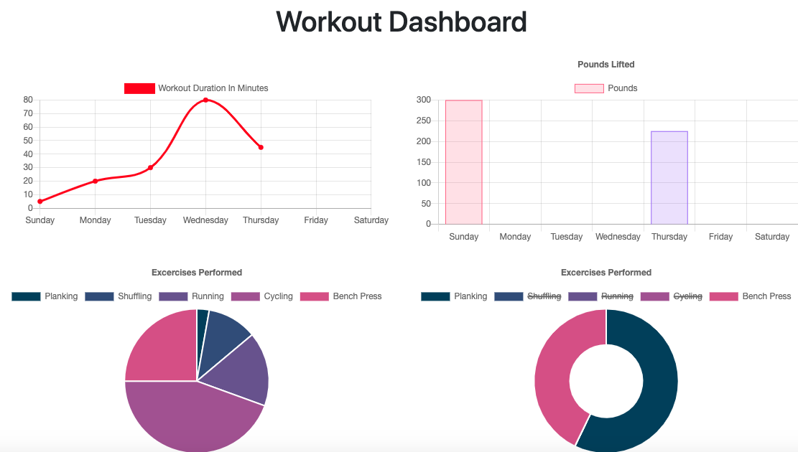

## Home Workout Tracker

As a user, I want to be able to view create and track daily workouts. I want to be able to log multiple exercises in a workout on a given day. I should also be able to track the name, type, weight, sets, reps, and duration of exercise. If the exercise is a cardio exercise, I should be able to track my distance traveled.

## Motivation

Given the provided front end code, create a mongo database which is responsive to all the needs of the workout tracker. Using mongoose!

## Website

The hosted heroku application: https://sheltered-spire-36879.herokuapp.com/

## Getting Started

1. Navigate to the landing page and see the stats from you last workout.
2. Choose to either Continue the last workout or begin a new one.
3. If continue is chosen, chose an exercise type from the drop down menu
4. Once submitted see how the stats update for that workout
5. If new workout is chosen the past days workout will be removed from the landing page.
6. Click on "Fitness Tracker Dashboard" in the top left corner of the landing page to see different graphs indicating different areas of performance

## Prerequisites

No special hardware or software is required to use this web app. All you need is a modern browser.

## Screenshots

## Built With

HTML
CSS
JavaScript
express
mongoose

## Author(s)

Wilson Birch (wilsonbirch)

## License

## Acknowlegments

Carleton University coding bootcamp homework project provided the front end code!
